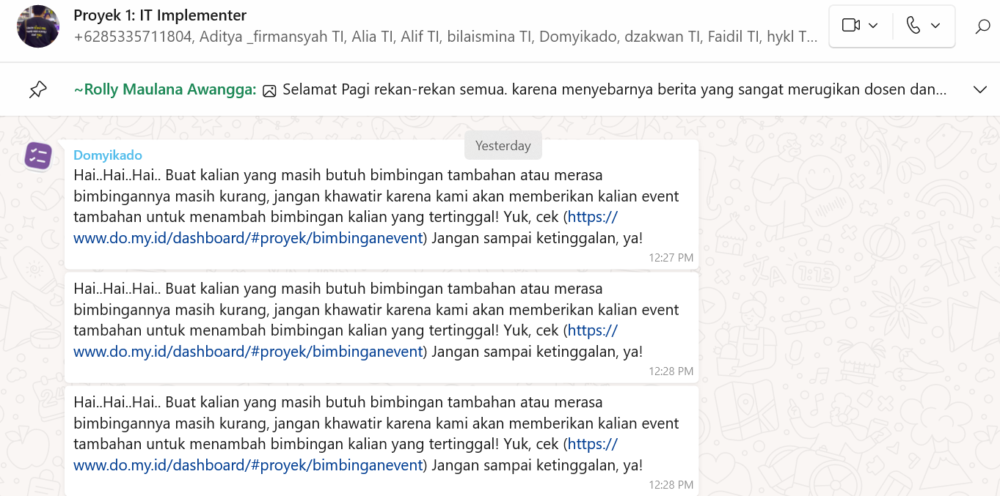
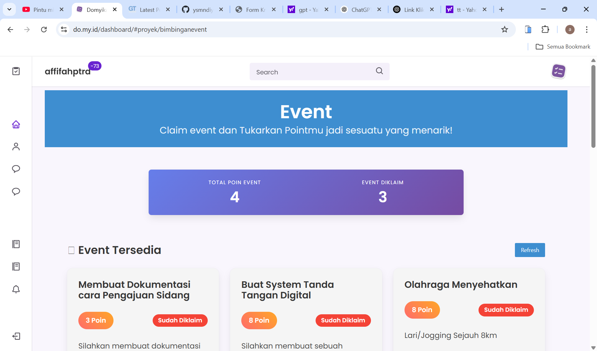
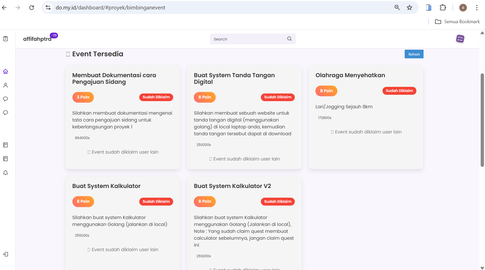
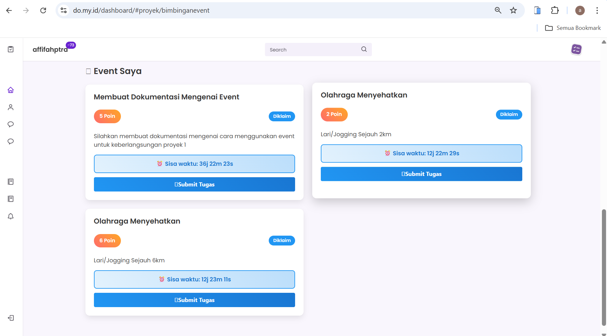
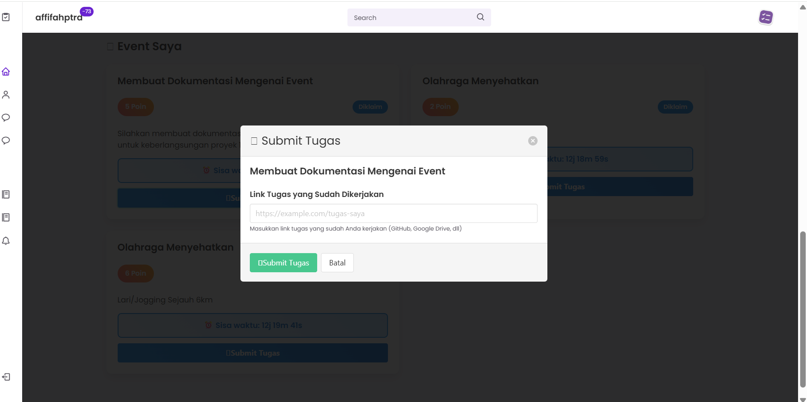
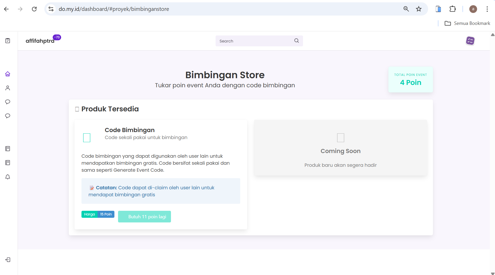

# EVENT
_Dokumentasi menggunakan event untuk keberlangsungan Proyek 1_

## Tata Cara:

- Setiap kali muncul notifikasi seperti ini, berarti sedang ada event bimbingan tambahan yang bisa diikuti dan kalian silahkan klik link tersebut. Jangan sampai terlewat!

- Setelah kalian klik link tersebut, maka kalian akan masuk ke halaman seperti ini.
  Di halaman ini, kalian bisa melihat berbagai event bimbingan tambahan yang tersedia.

- Nanti akan muncul beberapa event yang tersedia seperti ini.
  Kalian harus cepat ngeklaim event-nya sebelum diambil user lain, ya!
  Kalau udah diklaim, tombolnya akan berubah jadi “Sudah Diklaim” seperti yang terlihat di gambar.

- Setelah kalian klaim event-nya, maka akan muncul tugas seperti ini.
  Pastikan kalian menyelesaikan dan submit tugas sebelum waktu yang tertera habis (deadline).
  Jangan sampai terlambat, karena setiap event punya batas waktu masing-masing!

- Jika mau submit tugas, kalian bisa kumpulkan sesuai perintah yang muncul seperti ini.
  Tinggal tempelkan link hasil kerja kalian (bisa dari GitHub, Google Drive, dll),
  lalu klik tombol **Submit Tugas** dan jika sudah maka kalian akan dapat poin sesuai event tersebut.
  _Pastikan link bisa diakses, ya!_

- Poin yang kalian kumpulkan dari beberapa event tadi bisa ditukarkan di sini.
  Kalian bisa menukar poin tersebut dengan kode bimbingan yang bisa digunakan untuk dapat bimbingan gratis.
  _Pastikan poin kalian cukup 15, ya. Kalau belum cukup, ikuti lebih banyak event dulu!_

---

**EVENT**